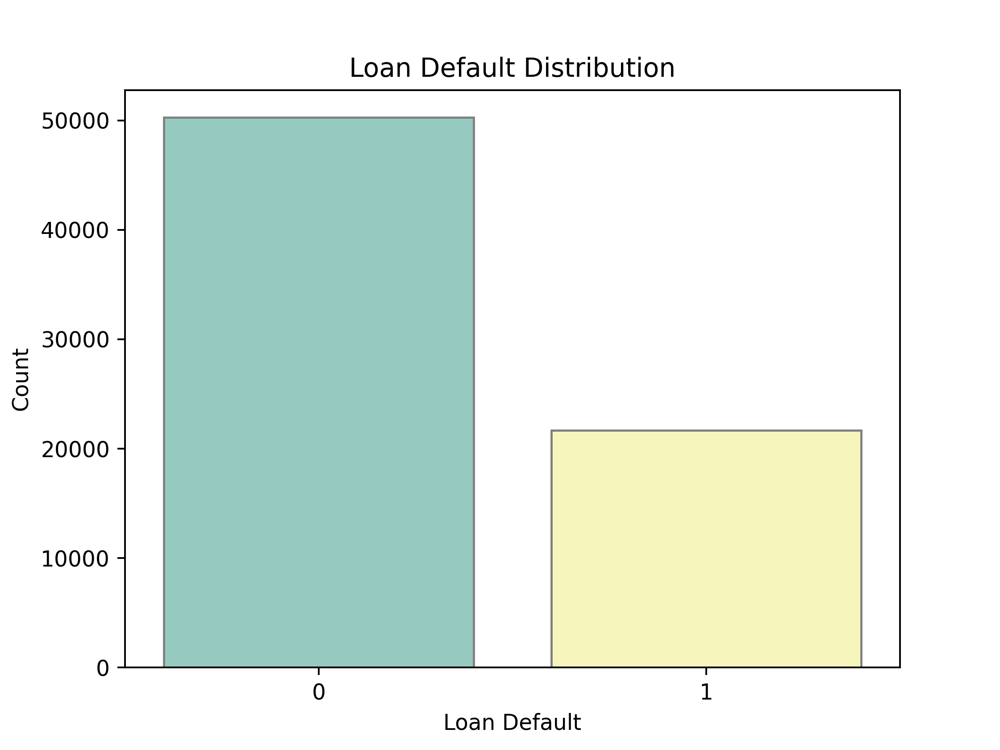
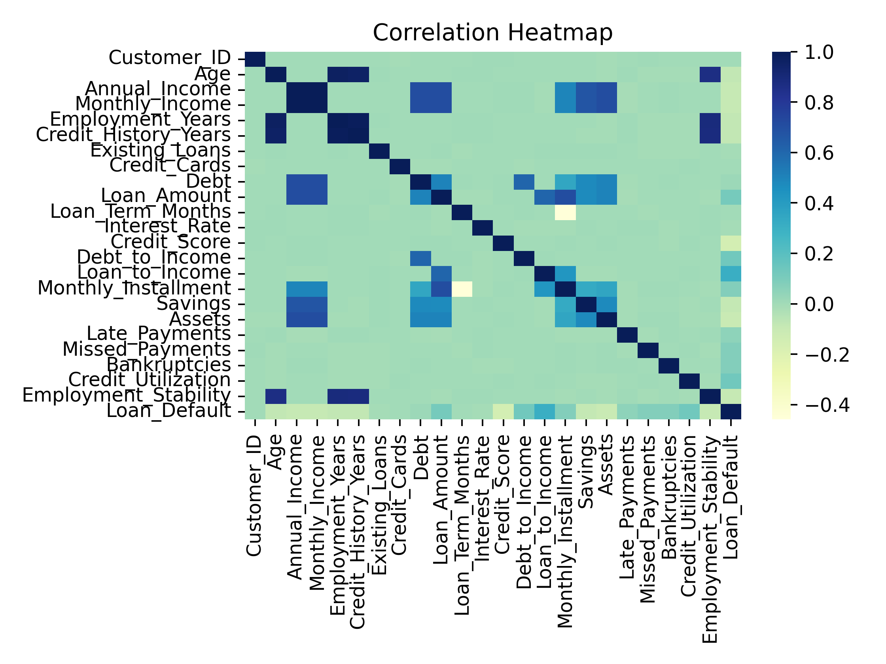
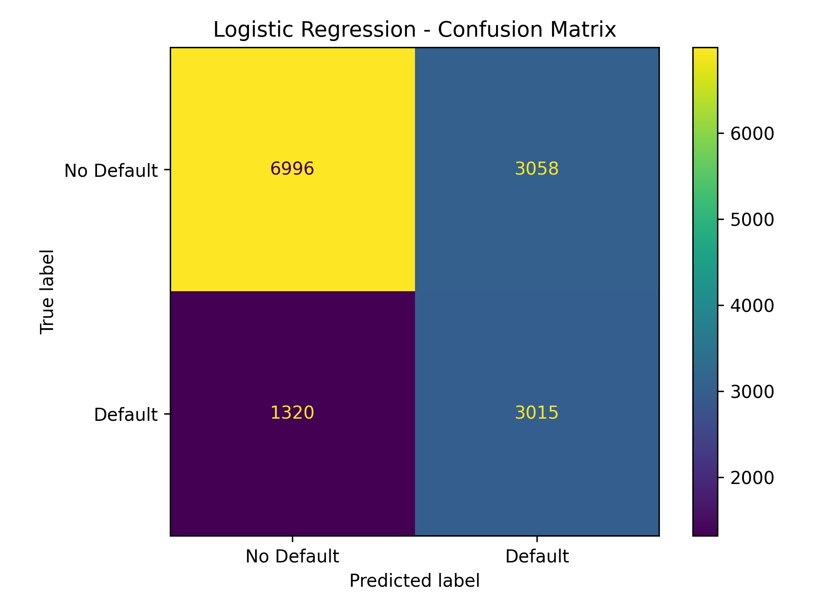
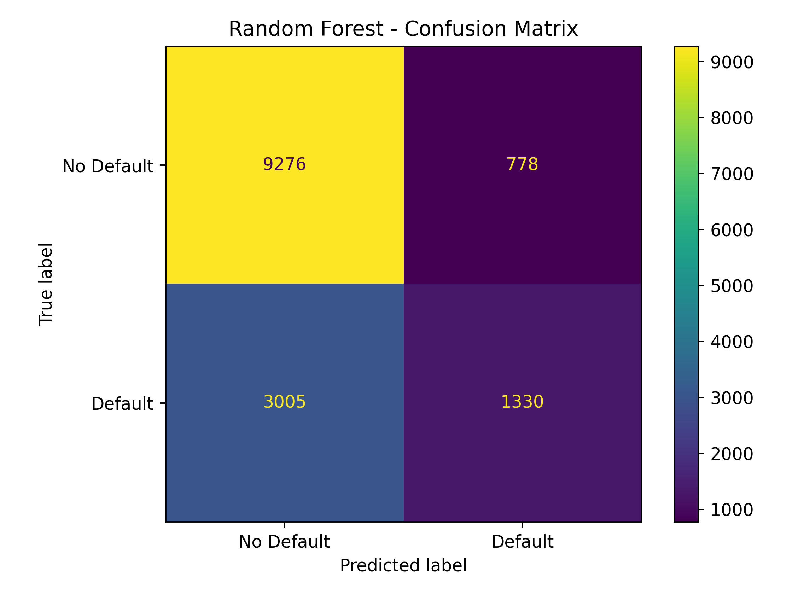
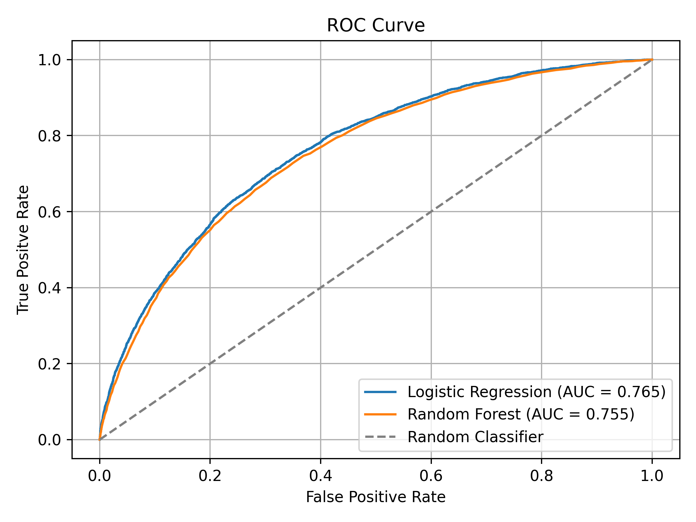
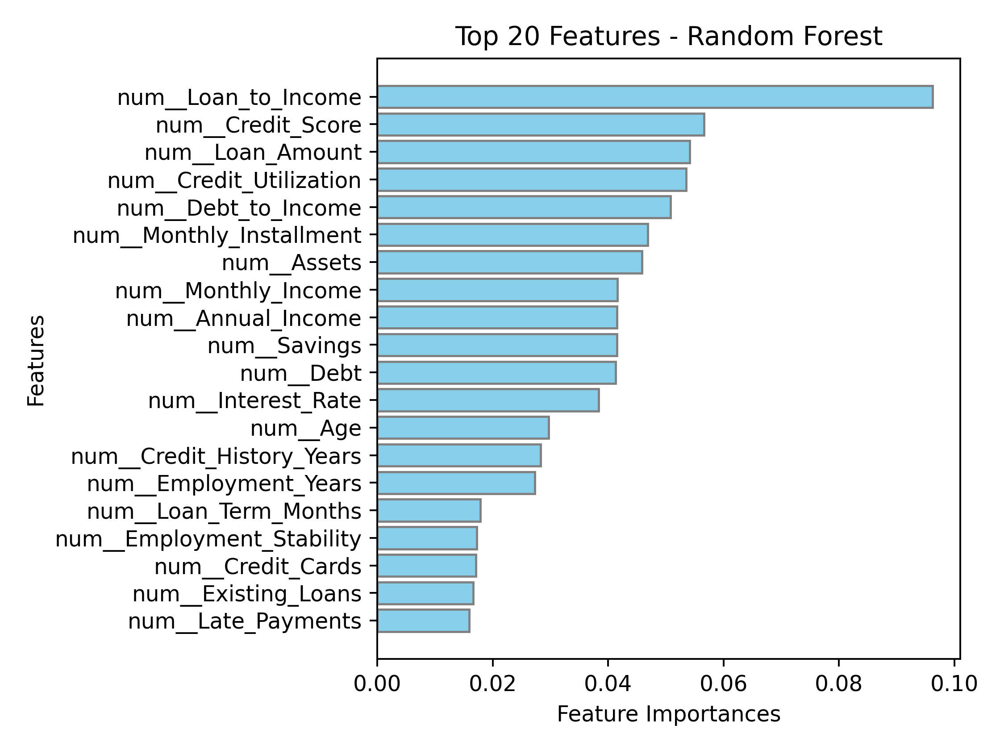
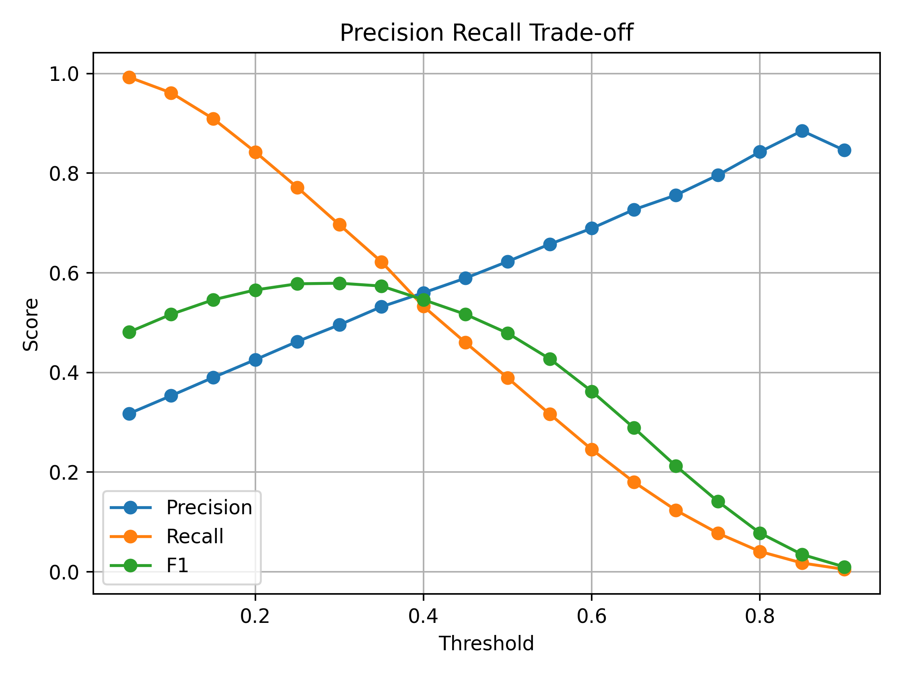

# 💳 Loan Default Prediction Using Machine Learning

> An end-to-end Machine Learning classification project for predicting whether a borrower is likely to default on a loan.


---

## 📌 Project Overview

Loan default prediction is a binary classification problem where the objective is to identify borrowers who are likely to default on their loans.

This project builds and evaluates two classification models:

- **Logistic Regression**
- **Random Forest Classifier**

The project goes beyond simply training a model — it includes:

- Exploratory Data Analysis (EDA)
- Class Distribution 
- Correlation Analysis
- Numerical and Categorical Preprocessing
- Missing-Value Handling
- Feature Scaling
- One-Hot Encoding
- Stratified Train/Test Splitting
- Hyperparameter Tuning
- Class Imbalance Handling
- Confusion Matrix
- Classification Report
- ROC-AUC Evaluation
- Feature Coefficient Analysis
- Feature Importance Analysis
- Decision-Threshold Analysis

The main focus is not only **accuracy**, but understanding the trade-off between **precision, recall, and F1-score**, especially for the minority `Default` class.

---

## 🎯 Project Objective

The primary objective is to build a classification system capable of distinguishing between:

| Class | Meaning     |
|:-----:|:------------|
| `0`   | No Default  |
| `1`   | Default     |

Because failing to identify a potential defaulter is typically more costly than incorrectly flagging a non-defaulter, **recall and F1-score for the Default class** are the primary evaluation metrics in this project.

---

## 📊 Dataset

The dataset contains **71,942 loan records** with **33 predictive features** after removing the customer identifier and target variable.

### Dataset Summary

| Property         | Value             |
|:------------------|-------------------:|
| Total Records      | 71,942             |
| Input Features      | 33                  |
| Target               | `Loan_Default`     |
| Task                  | Binary Classification |
| Training Samples      | 57,553             |
| Testing Samples        | 14,389             |
| Default Class            | 30.13%             |
| No Default Class          | 69.87%             |

### Target Distribution

The target variable is moderately imbalanced:

- **No Default:** 69.87%
- **Default:** 30.13%



This imbalance matters because a model could achieve relatively high accuracy while still performing poorly at detecting actual defaults.

---

## 🔍 Exploratory Data Analysis

The exploratory analysis focused on:

- Target Distribution
- Numerical Feature Distributions
- Feature-Target Relationships
- Correlation Analysis
- Outlier Detection
- Categorical Feature Distributions

Several financial variables — such as income, savings, and assets — showed noticeable skewness and outliers. However, skewness alone does not determine whether a feature is useful for classification; some highly skewed features had relatively weak linear correlation with the target.

### Correlation Analysis



The strongest numerical relationships with `Loan_Default` were:

| Feature              | Correlation |
|:----------------------|-------------:|
| Loan_to_Income          | 0.309        |
| Debt_to_Income           | 0.133        |
| Credit_Utilization        | 0.130        |
| Loan_Amount                 | 0.114        |
| Bankruptcies                  | 0.081        |
| Monthly_Installment             | 0.080        |
| Missed_Payments                    | 0.079        |
| Credit_Score                          | -0.150       |

> **Note:** Correlation only measures linear association. A low correlation does **not** automatically mean a feature is useless to a machine learning model — this becomes important when comparing correlation values against Random Forest feature importance later on.

---

## 🧹 Data Preprocessing

The preprocessing pipeline was designed separately for numerical and categorical features, and combined using a `ColumnTransformer` inside a Scikit-Learn `Pipeline`. This ensures no preprocessing step is ever applied manually outside the training workflow.

### Numerical Features

```
Missing Values → Median Imputation → Standard Scaling
```

```python
SimpleImputer(strategy="median")
StandardScaler()
```

### Categorical Features

```
Missing Values → Most-Frequent Imputation → One-Hot Encoding
```

```python
SimpleImputer(strategy="most_frequent")
OneHotEncoder(handle_unknown="ignore")
```

---

## ✂️ Train/Test Split

The dataset was split using an **80/20 stratified split** to preserve the original class distribution in both subsets.

| Subset   | Samples | No Default | Default |
|:---------|--------:|-----------:|--------:|
| Training | 57,553  | 69.87%     | 30.13%  |
| Testing  | 14,389  | 69.87%     | 30.13%  |

---

## 🤖 Models

Two classification algorithms were evaluated.

### Logistic Regression

Used as the primary linear baseline and interpretable classification model.

```python
LogisticRegression(
    max_iter=1000,
    random_state=42
)
```

Hyperparameter tuning was later performed on `C` and `class_weight`. The final selected configuration was:

```python
C = 0.5
class_weight = "balanced"
```

### Random Forest Classifier

Used as a nonlinear ensemble model capable of capturing more complex relationships between features.

```python
RandomForestClassifier(
    n_estimators=200,
    n_jobs=-1,
    random_state=42
)
```

---

## ⚙️ Hyperparameter Tuning

Hyperparameter tuning was applied to Logistic Regression using `GridSearchCV`.

**Search space:**

```python
C = [0.01, 0.1, 0.5, 1, 10]
class_weight = [None, "balanced"]
```

The optimization metric was **F1-score**, since the project prioritizes correctly identifying the Default class over maximizing raw accuracy.

| Result                  | Value      |
|:--------------------------|:-----------|
| Best Parameters             | `C=0.5`, `class_weight="balanced"` |
| Best Cross-Validation F1      | ≈ 0.58     |

---

## ⚖️ Class Imbalance Handling

Introducing `class_weight="balanced"` substantially improved the model's ability to detect the minority class, at the cost of some accuracy and precision.

| Metric    | Before | Balanced |
|:----------|-------:|---------:|
| Accuracy  | 0.745  | 0.696    |
| Precision | 0.623  | 0.496    |
| Recall    | 0.389  | 0.696    |
| F1        | 0.479  | 0.579    |
| ROC-AUC   | 0.765  | 0.765    |

> Recall and F1 improved significantly, while accuracy and precision decreased. For a loan-default screening problem, this trade-off can be meaningful — missing a true defaulter is often more costly than investigating an extra false positive.

---

## 📊 Model Performance

| Model               | Accuracy | Precision | Recall | F1    | ROC-AUC |
|:---------------------|---------:|----------:|-------:|------:|--------:|
| Logistic Regression   | ~0.696   | ~0.496    | ~0.696 | ~0.579 | ~0.765  |
| Random Forest          | ~0.737   | ~0.631    | ~0.307 | ~0.413 | ~0.755  |

**Interpretation:** Random Forest achieved higher precision and accuracy, but Logistic Regression was substantially better at identifying actual defaults. Since identifying potential defaults is the core objective of this project, **Logistic Regression with class weighting is the preferred model**.

---

## 🧮 Confusion Matrix

The confusion matrix provides a direct view of true negatives, false positives, false negatives, and true positives. For this problem, **false negatives are particularly important** — they represent borrowers who actually defaulted but were classified as non-defaulters.

### Logistic Regression



### Random Forest



Random Forest produced fewer false positives but more false negatives compared to Logistic Regression — this explains why it had higher precision but considerably lower recall for the Default class.

---

## 📈 ROC-AUC

ROC-AUC evaluates how well a model separates the two classes across different classification thresholds.



| Model               | ROC-AUC |
|:---------------------|--------:|
| Logistic Regression   | ≈ 0.765 |
| Random Forest          | ≈ 0.755 |

Logistic Regression achieved a slightly higher ROC-AUC.

---

## 🔎 Feature Interpretation

### Logistic Regression Coefficients

| Feature               | Coefficient |
|:------------------------|-------------:|
| Loan_to_Income            | +0.815       |
| Credit_Score                | -0.405       |
| Credit_Utilization             | +0.348       |
| Debt_to_Income                    | +0.331       |
| Employment_Stability                 | -0.270       |
| Assets                                  | -0.239       |
| Missed_Payments                            | +0.206       |
| Bankruptcies                                  | +0.201       |

Positive coefficients increase the model's tendency toward the Default class, while negative coefficients decrease it, holding other variables constant. For example:

- Higher `Loan_to_Income` → stronger tendency toward default
- Higher `Credit_Utilization` → stronger tendency toward default
- Higher `Debt_to_Income` → stronger tendency toward default
- Higher `Credit_Score` → lower tendency toward default

### Random Forest Feature Importance



The most influential features were:

1. Loan_to_Income
2. Credit_Score
3. Loan_Amount
4. Credit_Utilization
5. Debt_to_Income
6. Monthly_Installment
7. Assets
8. Monthly_Income
9. Annual_Income
10. Savings

Interestingly, some features with relatively weak linear correlation to the target still received meaningful importance from Random Forest — a reminder that **correlation ≠ model feature importance**.

---

## 🎚️ Decision Threshold Analysis

Classification models don't have to use 0.50 as their decision threshold. Logistic Regression's probability outputs were evaluated across multiple thresholds to explore the precision-recall trade-off.



| Threshold | Precision | Recall | F1    |
|:----------|----------:|-------:|------:|
| 0.50 (default) | ≈ 0.623 | ≈ 0.389 | ≈ 0.479 |
| ≈ 0.30    | ≈ 0.496   | ≈ 0.697 | ≈ 0.579 |

Lowering the threshold to ~0.30 significantly improved recall and F1 for the Default class.

> **Note:** Threshold selection here was performed as a decision-threshold analysis on held-out test predictions. It should be interpreted as an exploratory operating-point analysis rather than an untouched final test evaluation.

---

## 🧠 Key Findings

1. **Accuracy alone was misleading.** With a 69.87% / 30.13% class split, a model can achieve reasonable accuracy while still missing many actual defaults.
2. **Class weighting was highly effective.** Using `class_weight="balanced"` increased Default recall from 0.389 → 0.696 and F1 from 0.479 → 0.579.
3. **Logistic Regression outperformed Random Forest on the selected objective.** Although Random Forest had higher precision and accuracy, Logistic Regression achieved higher recall, higher F1, and a slightly higher ROC-AUC.
4. **Loan-to-Income was consistently important**, appearing as one of the strongest predictors in both the Logistic Regression coefficients and the Random Forest feature importances.
5. **Feature skewness does not automatically mean low predictive value.** Several heavily skewed financial variables still carried real predictive signal — linear and tree-based models can respond very differently to the same feature.

---

## 🛠️ Technologies Used

- 🐍 Python
- 🐼 Pandas
- 🔢 NumPy
- 📊 Matplotlib
- 🎨 Seaborn
- 🤖 Scikit-Learn
- 📈 Logistic Regression
- 🌲 Random Forest
- 🔧 GridSearchCV
- ⚙️ Pipeline
- 🔄 ColumnTransformer
- 📐 StandardScaler
- 🔤 OneHotEncoder
- 🩹 SimpleImputer
- 📊 Classification Metrics

---

## 📁 Project Structure

```
loan-default-prediction/
│
├── data/
│   └── loan_default_prediction_dataset.csv
│
├── images/
│   ├── loan-default-distribution.png
│   ├── correlation-heatmap.png
│   ├── logistic-regression-confusion-matrix.png
│   ├── random-forest-confusion-matrix.png
│   ├── roc-curve.png
│   ├── random-forest-feature-importances.png
│   └── threshold-tuning.png
│
├── loan_default_prediction.py
│
├── .gitignore
├── LICENSE
├── README.md
└── requirements.txt
```

---

## 🚀 Installation

Clone the repository:

```bash
git clone https://github.com/nomilabs/Loan-Default-Prediction.git
```

Navigate to the project directory:

```bash
cd Loan-Default-Prediction
```

Create a virtual environment:

```bash
python -m venv venv
```

Activate it:

```bash
# Windows
venv\Scripts\activate

# macOS / Linux
source venv/bin/activate
```

Install dependencies:

```bash
pip install -r requirements.txt
```

---

## ▶️ Usage

Run the main script:

```bash
python loan_default_prediction.py
```

The script performs the following steps:

1. Dataset loading
2. Exploratory analysis
3. Correlation analysis
4. Train/test splitting
5. Preprocessing
6. Logistic Regression tuning
7. Random Forest training
8. Model evaluation
9. Confusion matrix generation
10. Feature analysis
11. ROC-AUC analysis
12. Decision-threshold analysis

---

## 📦 Requirements

The project uses the following major libraries:

```
pandas
numpy
matplotlib
seaborn
scikit-learn
```

Install all dependencies with:

```bash
pip install -r requirements.txt
```

---

## 🔮 Future Improvements

- Cross-validated threshold selection
- Probability calibration
- Precision-Recall curves
- Cost-sensitive learning
- SMOTE / alternative imbalance strategies
- XGBoost / LightGBM comparison
- SHAP-based model interpretation
- Feature engineering
- Business-cost optimization
- Fairness and bias analysis
- Deployment using Streamlit or FastAPI
- Model monitoring

---

## 📌 Final Conclusion

This project demonstrates a complete binary classification workflow for loan default prediction. The key lesson: **the best model is not necessarily the one with the highest accuracy.**

Random Forest achieved stronger precision and accuracy, while Logistic Regression provided substantially better recall and F1-score for the Default class. After handling class imbalance and tuning hyperparameters, the final Logistic Regression model achieved:

| Metric    | Score   |
|:----------|:--------|
| Accuracy  | ≈ 0.696 |
| Precision | ≈ 0.496 |
| Recall    | ≈ 0.696 |
| F1        | ≈ 0.579 |
| ROC-AUC   | ≈ 0.765 |

For the project's objective of identifying potential loan defaults, **Logistic Regression with balanced class weights** was selected as the preferred model.

---

## 👨‍💻 Author

**Nouman Masood**

AI / Robotics Engineer in training · Machine Learning · Python · Data Science

---

## 📜 License

This project is licensed under the MIT License. See the [LICENSE](LICENSE) file for details.

---

### ⭐ If you found this project useful, consider giving the repository a star on GitHub!